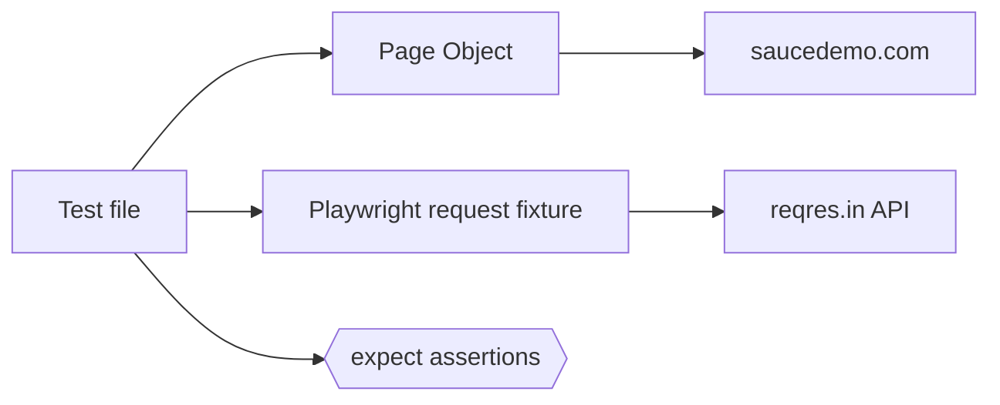

<div align="center">

# QA Automation with Playwright + TypeScript

UI and API test automation for **[saucedemo.com](https://www.saucedemo.com)** and **[reqres.in](https://reqres.in)**


</div>

---

## At a glance

| | |
|---|---|
| **Tests** | 8 total: 5 UI, 3 API |
| **Browser** | Chromium only |
| **Pattern** | Page Object Model with shared test data |
| **Language** | TypeScript (strict mode, no `any`) |
| **Secrets** | API key kept in `.env`, never committed |

---

## Contents

[What is tested](#what-is-tested) · [Setup](#setup) · [Run the tests](#run-the-tests) · [Demo mode](#demo-mode) · [Project structure](#project-structure) · [Design decisions](#design-decisions) · [Troubleshooting](#troubleshooting)

---

## What is tested

### UI tests (saucedemo.com)

| # | Scenario | What it checks | File |
|:-:|----------|----------------|------|
| 1 | Valid login | "Products" title is visible | `tests/ui/login.spec.ts` |
| 2 | Locked-out user | Error message contains "locked out" | `tests/ui/login.spec.ts` |
| 3 | Add to cart | Cart badge shows `1` | `tests/ui/cart.spec.ts` |
| 4 | Remove from cart *(bonus)* | Cart badge disappears | `tests/ui/cart.spec.ts` |
| 5 | Logout *(bonus)* | Back on the login page | `tests/ui/cart.spec.ts` |

### API tests (reqres.in)

| # | Request | What it checks | File |
|:-:|---------|----------------|------|
| 6 | `GET /api/users/2` | Status `200` and `data.email` exists | `tests/api/users.spec.ts` |
| 7 | `POST /api/users` | Status `201` and name is `morpheus` | `tests/api/users.spec.ts` |
| 8 | `GET /api/users/23` *(bonus)* | Status `404` | `tests/api/users.spec.ts` |

Also done: login steps are reused through Page Objects (`pages/LoginPage.ts`, `pages/InventoryPage.ts`).

### How a test flows



UI tests drive the browser through page objects. API tests send HTTP requests directly, so no browser opens. Every test ends with `expect` assertions.

---

## Setup

**Requirements:** Node.js 18 or newer (npm is included).

### 1. Clone and install

```bash
git clone https://github.com/jeevanL16/my-qa-assignment.git
cd my-qa-assignment
npm install
npx playwright install chromium
```

### 2. Add your ReqRes API key

The API tests need a free ReqRes key, sent in the `x-api-key` header. Without it, ReqRes returns `401`.

**Get a key**
1. Create a free account at [reqres.in](https://reqres.in).
2. Open your project (**Projects** → your project) and find **Access, API keys & credentials**.
3. Copy the **Manage** key (`pro_...`). The POST test needs write access, so the read-only public key (`pub_...`) is not enough.

**Create your `.env` file**

| Shell | Command |
|-------|---------|
| macOS / Linux | `cp .env.example .env` |
| Windows PowerShell | `Copy-Item .env.example .env` |
| Windows Command Prompt | `copy .env.example .env` |

Then open `.env` and set your key:

```env
REQRES_API_KEY=your_actual_api_key_here
```

> [!IMPORTANT]
> `.env` is gitignored and must never be committed. Only `.env.example` is tracked.

> [!NOTE]
> UI tests run without a key. Only the 3 API tests need it. If the key is missing they fail immediately with: `REQRES_API_KEY is not set. Copy .env.example to .env and add your key.`

---

## Run the tests

```bash
npx playwright test
```

Expected result:

```text
8 passed
```

| Command | What it does |
|---------|-------------|
| `npx playwright test` | Run all 8 tests (headless) |
| `npx playwright test tests/ui` | Run only the 5 UI tests |
| `npx playwright test tests/api` | Run only the 3 API tests |
| `npx playwright test -g "locked out"` | Run one test by part of its name |
| `npx playwright test --list` | List all tests without running them |
| `npx playwright test --headed` | Run with a visible browser |
| `npx playwright test --ui` | Open UI mode to run and inspect tests |
| `npx playwright show-report` | Open the HTML report of the last run |
| `npx tsc --noEmit` | Type-check the project |

<details>
<summary><b>How to see what the API tests do</b></summary>

<br>

API tests use Playwright's built-in `request` fixture, so **no browser opens**. To inspect each request, status code and response body:

```bash
npx playwright test tests/api --trace on
npx playwright show-report
```

Open a test, then its trace, and check the **Network** tab.

</details>

---

## Demo mode

Runs tests one at a time in a visible browser with a slow-motion delay (1.5 seconds between actions). Useful for live walkthroughs.

```bash
# One specific test
npm run demo -- -g "valid user can log in"

# All UI tests, one by one
npm run demo -- tests/ui
```

The `--` before the flags is required. Demo mode lives in `playwright.demo.config.ts` and does not affect normal runs. API tests have no browser, so slow motion does not apply to them.

---

## Project structure

```text
my-qa-assignment/
├── tests/
│   ├── test-data.ts              # Shared URLs, credentials, product IDs
│   ├── ui/
│   │   ├── login.spec.ts         # Login tests (scenarios 1-2)
│   │   └── cart.spec.ts          # Cart and logout tests (scenarios 3-5)
│   └── api/
│       └── users.spec.ts         # ReqRes API tests (scenarios 6-8)
├── pages/
│   ├── LoginPage.ts              # Login page object
│   └── InventoryPage.ts          # Products page object
├── playwright.config.ts          # Main config: Chromium only, data-test attribute
├── playwright.demo.config.ts     # Headed + slow-motion config for demos
├── tsconfig.json                 # TypeScript strict mode
├── package.json
├── .env.example                  # Environment variable template
├── .gitignore
└── README.md
```

---

## Design decisions

| Decision | Why |
|----------|-----|
| **Page Object Model** | `LoginPage` and `InventoryPage` hold locators and actions, so tests stay short and readable. |
| **`getByTestId` locators** | saucedemo uses `data-test` attributes, set via `testIdAttribute` in the config. No XPath or long CSS. |
| **Web-first assertions, no hard waits** | Tests rely on auto-waiting and auto-retrying `expect`. There are no `waitForTimeout` calls. |
| **Independent tests** | Each test sets up its own state, so order does not matter and tests can run in parallel. |
| **Centralized test data** | URLs, credentials and product IDs live in `tests/test-data.ts`. |
| **Fail-fast API key check** | `getApiHeaders()` throws a clear message if `REQRES_API_KEY` is missing. |
| **Typed API responses** | Small TypeScript interfaces describe response bodies. No `any`. |
| **Small scope** | Chromium only, and no CI, Docker or reporting tools, as the assignment does not require them. |

---

## Troubleshooting

<details>
<summary><b>API tests fail with "REQRES_API_KEY is not set"</b></summary>

<br>

`.env` is missing or empty. Copy `.env.example` to `.env` and add your key.

</details>

<details>
<summary><b>API tests return 401 or 403</b></summary>

<br>

The key is wrong or missing. Use the **Manage** key (`pro_...`) from your ReqRes project, and make sure there are no spaces or quotes around it in `.env`.

</details>

<details>
<summary><b>"Executable doesn't exist" or browser not found</b></summary>

<br>

Run `npx playwright install chromium`.

</details>

<details>
<summary><b>UI tests time out</b></summary>

<br>

Check your internet connection and that saucedemo.com is reachable, then run the tests again.

</details>

<details>
<summary><b>Demo mode is not slow or visible</b></summary>

<br>

Use `npm run demo`, not `npx playwright test`.

</details>